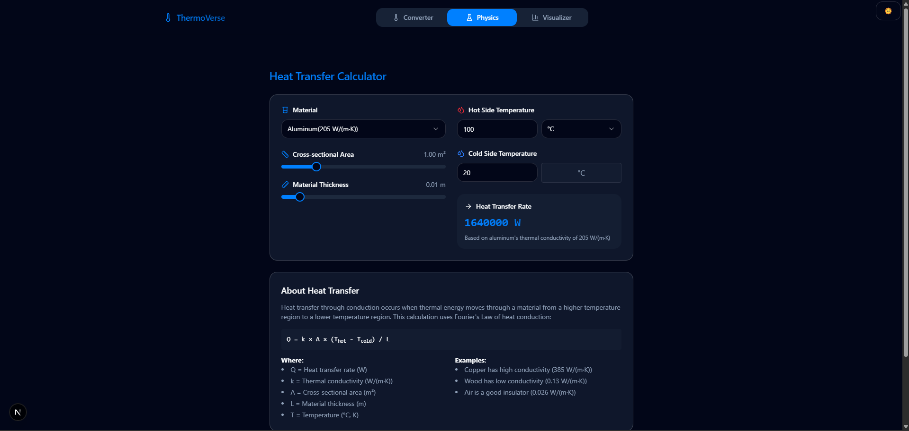
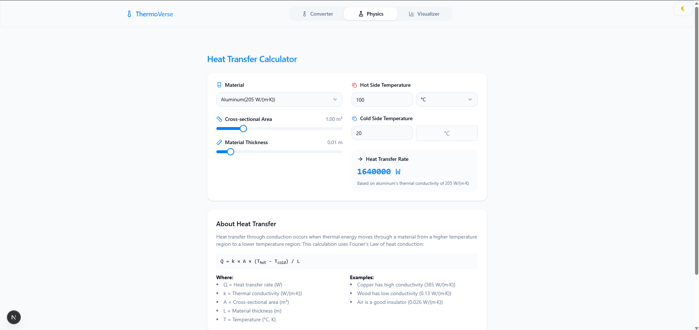

# Thermoverse
- Thermoverse is a Temperature Dashboard application designed to provide tools to do almost all kind of temperature related tasks. It offers a user-friendly interface to visualize temperature data and supports integration with various data sources.
- 

## Features

- **Real-Time Monitoring**: Track temperature changes in real-time.
- **Data Visualization**: Interactive charts and graphs for better insights.
- **Custom Alerts**: Set thresholds and receive notifications for temperature anomalies.
- **Multi-Source Integration**: Connect to multiple data sources for comprehensive monitoring.
- **Responsive Design**: Optimized for both desktop and mobile devices.
- **Hot Module Replacement (HMR)**: Enables faster development by updating modules without a full reload.
- **Tailwind Merge Configuration**: Enhanced utility class merging for better styling consistency.
- **More Upcoming Tool**: More tools are on the way and will be regulary added to this thermoverse.

## Look

- Dark Theme
- 

- Light Theme
- 
## Installation

Follow these steps to set up the project locally:

1. Clone the repository:
   ```bash
   git clone https://github.com/ankurjaiswalofficial/thermoverse.git
   cd thermoverse
   ```

2. Install dependencies:
   ```bash
   npm install
   ```

3. Start the development server:
   ```bash
   npm start
   ```

4. Open your browser and navigate to `http://localhost:3000`.

## Usage

1. Launch the application and connect your preferred data source.
2. Configure temperature thresholds and alerts in the settings.
3. View real-time temperature data on the dashboard.
4. Analyze historical data using the provided visualization tools.
5. During development, leverage HMR for instant updates without refreshing the page.

## Contributing

We welcome contributions to improve Thermoverse! To contribute:

1. Fork the repository.
2. Create a new branch for your feature or bug fix:
   ```bash
   git checkout -b feature-name
   ```
3. Commit your changes and push the branch:
   ```bash
   git commit -m "Add feature-name"
   git push origin feature-name
   ```
4. Open a pull request describing your changes.

## License

This project is licensed under the [MIT License](LICENSE).
